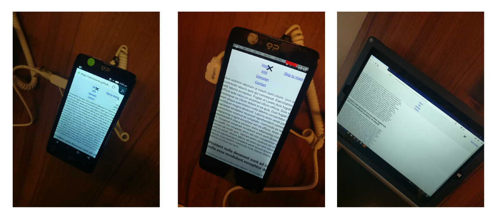
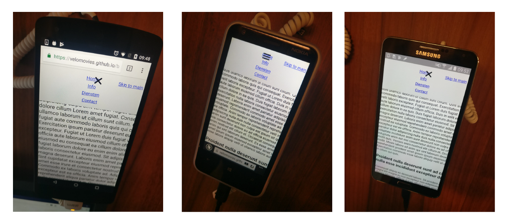

# Menu Component

Hier vindt je een uitwerking van het menu component. Het menu is een belangrijk deel op een website. Er wordt steeds vaker gebruik gemaakt van een hamburger menu. Deze werkt echter altijd vaak met javascipt. Door het op een goede manier te maken, zou het menu ook beschikbaar moeten zijn op oudere browsers. Als je het menu niet kan bereiken wordt een website al snel onmogelijk om te gebruiken.

[Live Demo](https://velomovies.github.io/browser-technologies/opdracht2/Menu/index.html)

## De enhencement

Zonder javascript en css staat het menu onderaan de pagina, maar met bovenaan een link naar het menu. Door css toe te voegen heb ik de link naar het menu op een betere plek gezet. 

Met het toevoegen van de javascript wordt het menu een hamburger menu. Deze kan je openen en dicht doen. BIj het openen en sluiten veranderd er ook nog css.

Met javascript wordt een class toegevoegd aan de elementen. Daardoor zie je het menu component van plaats veranderen. 
Dit doe ik doormiddel van: 
```javascript
document.querySelector('nav').classList.add('hamburger')
```

Helaas wordt `querySelector` niet ondersteund bij elke gebruiker. Om te checken of deze feature werk doe ik het volgende.
```javascript
if (document.querySelector || ('classList' in document.body)) {
  // Code....
}
```
Naast het checken op de querySelector wordt er gecheckt op classList in de body. Als deze niet worden ondersteund zal de javascript niet lopen. Daardoor is de website ge-enhenced voor die gebruiker.

## Testen

Onderstaand de testen die ik gedaan heb bij het device-lab.



Het component werkt zo goed als op alle websites. Ze werken alleen niet allemaal op dezelfde manier:
* Chrome --> werkt
* IE8 --> werkt, maar de javascript niet  (door `classList`)
*  Mozilla firefox --> werkt

## Bronnen
> https://developer.mozilla.org/en-US/docs/Learn/Tools_and_testing/Cross_browser_testing/Feature_detection

## Opdracht 2 - 1, 2, 3 Feature Detectie
//Wat laat je zien als een browser of gebruiker 'enhancement' niet kan tonen of zien? Hoe doe je Feature Detection en wat doe je als een techniek niet werkt?

Werk 2 componenten uit in een demo. Je onderzoekt hoe je verschillende features door verschillende browsers worden ondersteund en hoe je voor goede fallback kan zorgen. Gebruik [html5test.com](https://html5test.com), [css3test.com](http://css3test.com) en [kangax.github.io/compat-table/es6/](https://kangax.github.io/compat-table/es6/)

- Per feature: Zoek uit hoe je deze kunt testen. Verzamel uitleg en artikelen. Bouw een (kleine) progressive enhanced demo (zonder extra tools, gewoon in 1 HTML file, zo simpel mogelijk). Test de feature (en fallback) op verschillende browsers en het Device Lab. Let op: Gebruik van polyfills is niet toegestaan.
- Post je 2 demo’s op GitHub met uitleg in een README file. Wat is de feature? Welke browsers/devices ondersteunen deze wel/niet? Hoe zorg je dat de fallback nuttig is?

Beoordelingscriteria
- 2 componenten zijn onderzocht en er is een demo gemaakt.
- De code staat in een repository op GitHub.
- Een Readme is toegevoegd met, per feature:
  -	Een beschrijving van de feature.
  - Bronnen van uitleg en gebruikte artikelen.
  -	Welke browsers/devices ondersteunen deze wel/niet.
  -	Een beschrijving hoe de fallback werkt.