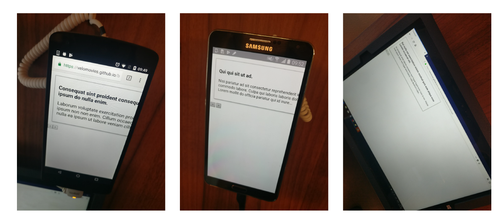
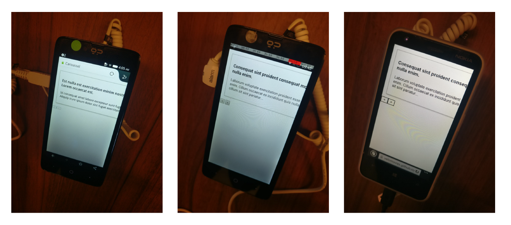

# Carrousel component

Een carrousel component laat een aantal secties zien naast elkaar. Zonder javacript wordt het al snel een slider met een scroll en zie je de info altijd. Echter je moet javascript gebruiken om de info op een goede manier te laten zien.

[Live Demo](https://velomovies.github.io/browser-technologies/opdracht2/carrousel/index.html)

## De enhencement

De articles worden laten zien als er geen js of css is. Zodra er css wordt gebruikt zie je de articles naast elkaar waar je vervolgens door heen kan scrollen. Bij het toevoegen van javascript worden de andere articles verborgen en kan je klikken tussen de articles. 

Met javascript wordt een class toegevoegd aan de elementen. Daardoor zie je het menu component van plaats veranderen. 
Dit doe ik doormiddel van: 
```javascript
article[i].classList.add('hidden')
```
Naast het toevoegen van een class voeg ik ook nog knoppen toe met javascript. Ik verberg de `articles` en laat het juist  `<article>` zien. Vervolgens voeg ik een `<button>` toe om tussen de articles te scrollen. Om het nog meer te enhencen zou ik moeten zorgen dat de gebruiker kan zien hoeveel articles er eigenlijk allemaal zijn. Daarnaast zou het helpen om alle in één oogopslag te kunnen zien.

Helaas wordt `querySelector` niet ondersteund bij elke gebruiker. Om te checken of deze feature werk doe ik het volgende.
```javascript
if (document.querySelector || ('classList' in document.body)) {
  // Code....
}
```
Naast het checken op de querySelector wordt er gecheckt op classList in de body. Als deze niet worden ondersteund zal de javascript niet lopen. Daardoor is de website ge-enhenced voor die gebruiker.

## Testen

Onderstaand de testen die ik gedaan heb bij het device-lab.



Ik heb er voor gezorgd dat het component in veel van de websites werkt:
* Chrome --> werkt
* IE8 --> content is zichtbaar, artikelen werken niet waardoor er geen style wordt geladen
* Firefox --> werkt. Geen grid, dus flexbox gebruikt

## Bronnen
> https://developer.mozilla.org/en-US/docs/Learn/Tools_and_testing/Cross_browser_testing/Feature_detection

## Opdracht 2 - 1, 2, 3 Feature Detectie
//Wat laat je zien als een browser of gebruiker 'enhancement' niet kan tonen of zien? Hoe doe je Feature Detection en wat doe je als een techniek niet werkt?

Werk 2 componenten uit in een demo. Je onderzoekt hoe je verschillende features door verschillende browsers worden ondersteund en hoe je voor goede fallback kan zorgen. Gebruik [html5test.com](https://html5test.com), [css3test.com](http://css3test.com) en [kangax.github.io/compat-table/es6/](https://kangax.github.io/compat-table/es6/)

- Per feature: Zoek uit hoe je deze kunt testen. Verzamel uitleg en artikelen. Bouw een (kleine) progressive enhanced demo (zonder extra tools, gewoon in 1 HTML file, zo simpel mogelijk). Test de feature (en fallback) op verschillende browsers en het Device Lab. Let op: Gebruik van polyfills is niet toegestaan.
- Post je 2 demo’s op GitHub met uitleg in een README file. Wat is de feature? Welke browsers/devices ondersteunen deze wel/niet? Hoe zorg je dat de fallback nuttig is?

Beoordelingscriteria
- 2 componenten zijn onderzocht en er is een demo gemaakt.
- De code staat in een repository op GitHub.
- Een Readme is toegevoegd met, per feature:
  -	Een beschrijving van de feature.
  - Bronnen van uitleg en gebruikte artikelen.
  -	Welke browsers/devices ondersteunen deze wel/niet.
  -	Een beschrijving hoe de fallback werkt.

