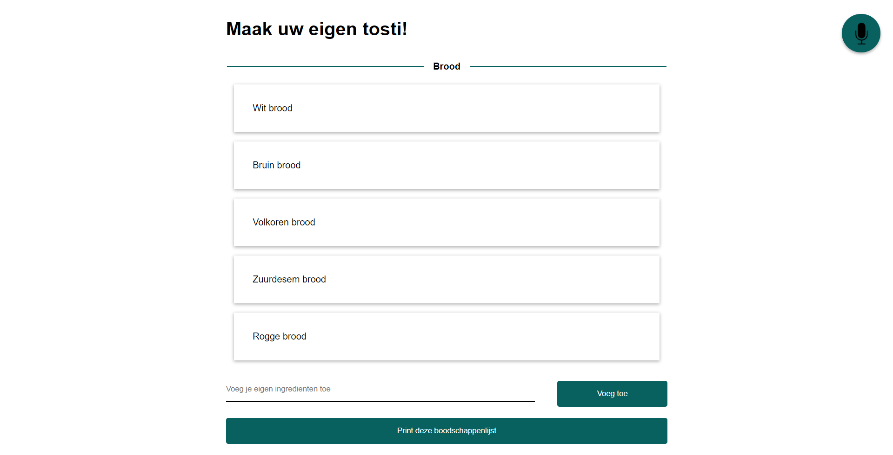

# Maak je eigen tosti!
//Robuuste, toegankelijke websites leren bouwen …

Voor opdracht 3 heb ik een case uitgekozen. De case is:
`Ik wil boodschappen-om-tostis-te-maken in mijn boodschappenlijstje kunnen gooien.`

Deze case heb ik uitgewerkt tot een werkend product.


> [**Sneak peak**](https://velomovies.github.io/browser-technologies/opdracht3/).

## De 'core' functionaliteit
De core functionaliteit van de case die ik heb gekozen is een lijst waar je kan kiezen welk product je wil hebben. Deze lijst bestaat uit een `form` waar je kan kiezen. Bij het kiezen, kiest de gebruiker wat er allemaal op zijn/haar tosti komt. Vervolgens zou de gebruiker deze lijst als boodschappenlijstje kunnen uitprinten en meenemen naar de winkel.

```HTML
<form>
  <fieldset>
    <legend>Titel</legend>
    <input type="radio"> of <input type="checkbox">
  </fieldset>
</form>
```

Dit `form` heb ik vervolgens uitgebreid naar een mooie lijst die je kan uitprinten.

Met javascript heb ik buttons en input fields toegevoegd. Dit zorgt ervoor dat een gebruiker zonder javascript de app nog, zonder foutmeldingen, goed kan gebruiken. Ik heb onderstaande code gebruikt om de buttons toe te voegen:
```javascript
element.insertAdjacentHTML('position', 'text')
```

### Drie lagen
De drie lagen die ik heb toegevoegd zijn redelijk duidelijk.
**Laag 1**
HTML en een beetje CSS. Deze laag is een formulier waarbij je kan kiezen welke producten je wil hebben. Zonder CSS zou dit ook werken, maar css maakt de app wel een stuk gebruiksvriendelijker. Er staat een tekst onder dat de gebruiker de pagina kan printen om 'niet te vergeten wat er gekocht moet worden.'

**Laag 2**
HTML, CSS en Javascript. Door CSS goed toe te voegen heb ik kunnen zorgen dat de print versie meer print vriendelijk is. Daarnaast kan ik met javascript een script toevoegen dat zorgt dat er een knop is om de pagina uit te printen.

**Laag 3**
Dit gaat vooral om de Javascript. Ik heb een functie toegevoegd waarbij je eigen ingredienten kan toevoegen. Deze wordt alléén laten zien als er javascript op de goede manier gebruikt kan worden. Naast deze functie heb ik een spraakherkening toegevoegd die het app gebruik kan verbeteren.

## Features

Ik heb een aantal features in de app toegevoegd. De meest basic versie heeft geen javascript. Vervolgens heb ik een [feature detect](https://developer.mozilla.org/en-US/docs/Learn/Tools_and_testing/Cross_browser_testing/Feature_detection) gedaan op een aantal features in javascript die ik gebruik. Daarbij heb ik deze code gebruikt:
```javascript
if ('querySelector' in document &&
    'classList' in document.body &&
    'addEventListener' in window) {
      // Jouw code...
}
```
Naast deze check heb ik gezorgd dat er een `classList.add('enhanced')` op de body komt. Daardoor kan ik in de CSS makkelijk een aantal dingen toevoegen/weghalen. 

De app maakt gebruik van spraakherkening van google. Deze wordt alléén ondersteund door chrome op dit moment (en is ook nog een webkit). Ik detect eerst of een gebruiker wel spraakherkening kan gebruiken. Daarnaast werkt spraakherkening alleen als er een `https://` verbinding is. Onderstaand de code die ik heb gebruikt:
```javascript
if ('webkitSpeechRecognition' in window &&
    location.protocol === 'https:') {
      // Jouw code...
}
```

## Accessibility 

Bij het maken van de app heb ik op een aantal accesibility problemen gelet.

De app is bijvoorbeeld volledig bestuurbaar via toetsenbord. Door te tabben en met de pijltjes toetsen te bewegen kan een gebruiker zijn lijstje volledig invullen.

Ik heb gebruik gemaakt van labels bij alle input fields. Ook maak ik gebruik van een legend. Dit is voor [screenreaders zeer ge-optimaliseerd](http://www.weba11y.com/blog/2016/04/22/screen-reader-support-for-new-html5-section-elements/), waardoor de website makeklijk te gebruiken is door slechtzienden

Daarnaast is het heel handig dat een gebruiker niet perse hoeft te scrollen. Door de [spraakherkening](https://developer.mozilla.org/en-US/docs/Web/API/SpeechRecognition) te gebruiken is de gebruiker zo bij een onderwerp. Dit kan zo veel uitgebreid worden als dat je zelf wil.

## De test

Onderstaand de testen die ik gedaan heb bij het device-lab. Bij alle telefoons deed de app het goed. De spraakherkening werkte alleen op `https://` en in een chrome browser. Het invoeren van een eigen ingredient werkte op alle devices.


Door een [feature detect](https://developer.mozilla.org/en-US/docs/Learn/Tools_and_testing/Cross_browser_testing/Feature_detection) heb ik gezorgd dat er geen knop verschijnt om de spraakherkening te starten. De spraakherkening doet het alleen op een google chrome browser. Het gaat echter in de komende maanden zeer waarschijnlijk uitbreiden naar firefox. Daarnaast heeft safari een manier van spraakherkening. Deze heb ik 

Ik heb de app tot aan IE10 getest. In IE10 doet de app het zo goed als helemaal. Je kan je eigen ingredienten toevoegen en kan de pagina printen. 

Op een telefoon browser kan je de pagina ook printen. Vervolgens kan je in het menu van de telefoon deze opslaan als `pdf`.

Mijn tests. (ook de mobiele varianten):
* IE10 --> Werkt (zonder spraakherkening)
* IE11 --> Werkt (zonder spraakherkening)
* Safari --> Werkt (zonder spraakherkening)
* Chrome --> Werkt helemaal (met spraakherkening)
* Firefox --> Werkt (zonder spraakherkening)

## TO DO

Op de telefoon werkt een print knop niet super handig. Ik zou als ik meer tijd (en meer geld) had gehad een manier willen gebruiken om de lijst op te slaan al images. Ik heb het een en ander gevonden over een [api](https://code.google.com/archive/p/jspdf/) waarbij je het op kon slaan als bestand. Dit maakt het voor de gebruiker handiger om de lijst te bekijken.

Door de app server-side te maken kan ik nog het een en ander toevoegen aan handige oplossingen. Zoals het toevoegen van een script die direct alle css en javascript minified. Daarnaast zou het helpen om een service worker toe te voegen. De app zou daardoor makkelijk offline te gebruiken kunnen zijn.

De spraakherkening kan nog meer uitgebreid worden. Naast dat het nu alleen nog maar werkt op Chrome zou het ook kunnen werken op Safari, al is dat op een andere manier. Daarnaast zou ik ook nog kunnen toevoegen dat er items uit het lijstje direct met de stem kunnen aangewezen. De spraakherkening kan je uiteindelijk zo ver uitbreiden als dat je zelf wil. 

## Opdracht 3 - Progressive Enhanced Browser Technologies
//Browser Technologies onderzoeken en implementeren als enhancement. Basic functionaliteit van een use case doorgronden.

Maak een demo op basis van een use case. Zorg dat alle gebruikers, met alle browsers, in iedere context minimaal de core functionaliteit te zien/horen/voelen krijgen. Bouw je demo in 3 lagen, volgens het principe van Progressive Enhancement. Gebruik als enhanced feature een (hippe, innovatieve, vooruitstrevende) Browser Technologie die je gaat onderzoeken op functionaliteit, toegankelijkheid en (browser) ondersteuning.

Beoordelingscriteria
- De code staat in een repository op GitHub
- Er is een Readme toegevoegd met daarin beschreven:
  - een beschrijving van de core functionality
  - een beschrijving van de feature(s)/Browser Technologies
  - welke browser de feature(s) wel/niet ondersteunen
  - een beschrijving van de accessibility issues die zijn onderzocht
- De demo is opgebouwd in 3 lagen, volgens het principe van Progressive Enhancement
- De user experience van de demo is goed
  - de leesbaarheidsregels zijn toegepast, contrast en kleuren kloppen
  - het heeft een gebruiksvriendelijke interface, met gebruikmaking van affordance en feedback op de interactieve elementen
- Student kan uitleggen wat Progressive Enhancement en Feature Detectie is en hoe dit toe te passen in Web Development

## License
GPL-3.0 © Victor Zumpolle
